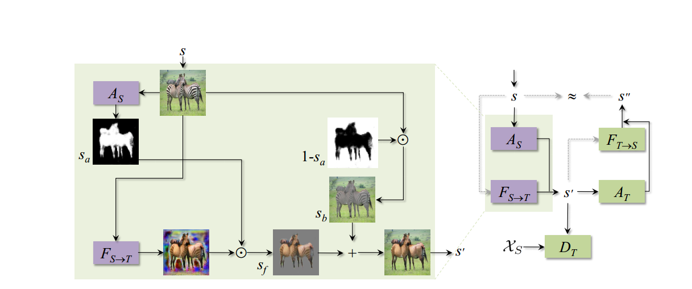
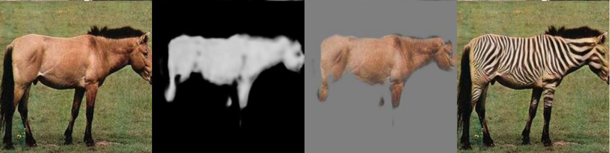
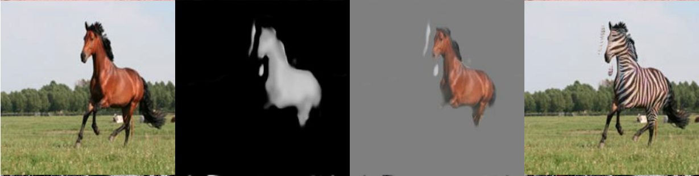
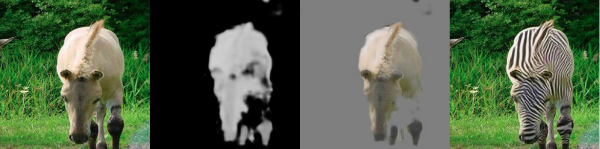
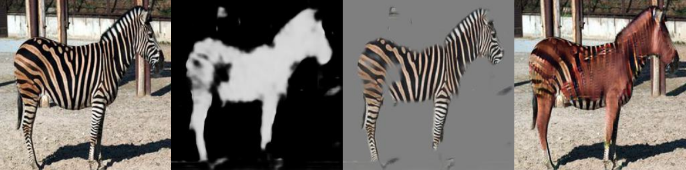
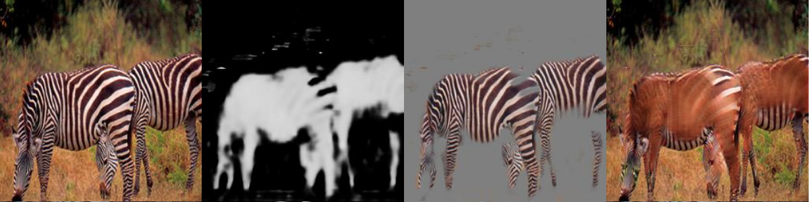

# Unsupervised Attention-guided Image-to-Image Translation

A Tensorlayer implementation of the paper "[Unsupervised Attention-guided Image-to-Image Translation](https://arxiv.org/pdf/1806.02311.pdf)"[1].


## Network architecture




## Results on Horse-to-zebra translation

The images within one row are: original input $s$, the attention mask $s_a$, the masked original image $s * s_a$, and the translated image $s'$ respectively. 

- horse2zebra:







- zebra2horse:

    

    

    


## requirements

- Ubuntu 18.04.3
- Python 3.7
- Tensorflow-gpu 2.0.0
- Tensorlayer 2.1.1
- CUDA 10.0

- anaconda


### Install Tensorflow-gpu 2.0.0 and Tensorlayer with anaconda

```shell
conda create --name project python=3.7
conda install tensorflow-gpu
conda activate project
pip install tensorlayer
```


## usage

### Configure your training and evaluation

Before training and evaluation, you have to configure your dataset and hyperparameters in `config/exp_xx.json`, where `xx` is your experiment name.

You do not need to download the dataset by yourself: the dataset will be automatically downloaded (a zip file) into your folder. See `data_loader.py` for details.

Currently we only support the following datasets:

`horse2zebra, apple2orange, lion2tiger, summer2winter_yosemite `

You can specify your training and testing dataset via editing `"dataset_name"` in `config/exp_xx.json`.

- For example, in training mode, the dataset_name can be `horse2zebra_train`
- In testing mode, the dataset_name can be `horse2zebra_test`


### Training and restoring from the specified checkpoint

To start training, run the `train.sh`:

```shell
bash train.sh
```

You have to modify `train.sh` to specify your configuration file name and where to store all the outputs (checkpoints, tensorboard events, and images).


To restore from the previous checkpoint, run the `restore.sh`

```shell
bash restore.sh
```

Here you have to modify `restore.sh` to specify your previous checkpoint.

### Evaluation

Run `test.sh`  for testing. You can see the results in your log_dir.

```shell
bash test.sh
```


 

## Reference

[1]. [Unsupervised Attention-guided Image-to-Image Translation](https://arxiv.org/pdf/1806.02311.pdf)
